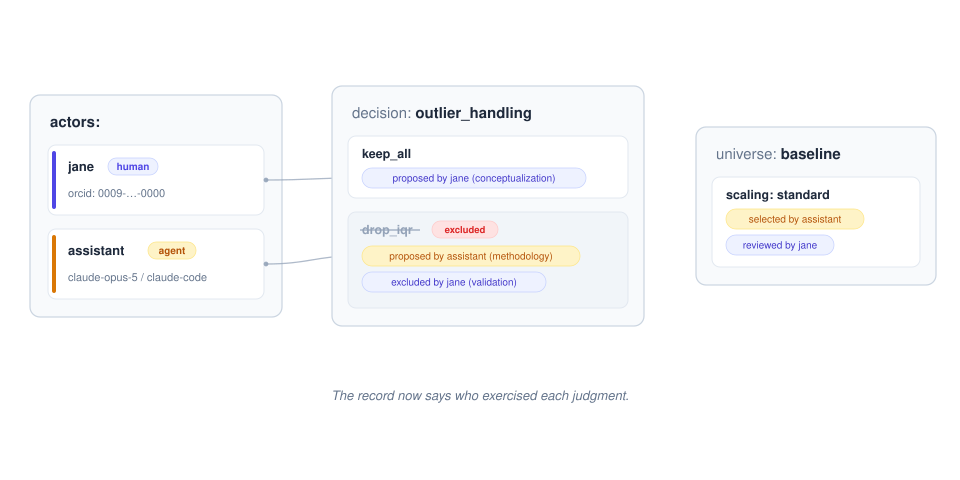
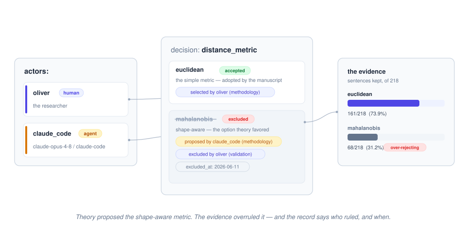

# ASTRA Actor Attribution — Demo

*Who proposed this option? Who ruled it out? Who signed off?*



[ASTRA](https://astra-spec.org) records the decision structure of a scientific
analysis — which options were considered, chosen, or excluded, and why — but
not **who** was involved. In today's records, a choice a researcher examined
and rejected is indistinguishable from a default nobody looked at. That
distinction is exactly what accountability, credit, and oversight of
AI-assisted science need.

This repo demonstrates **RFC-0003**: a small, optional, fully additive
**actor layer** — a registry of the humans and agents on an analysis, plus
attribution fields on the two places a "who" is meaningful: the *options* of
a decision and the *selections* of a universe.

## Try it

```bash
git clone --recurse-submodules https://github.com/Fosowl/actor_attributions_demo_astra_lightcone
cd actor_attributions_demo_astra_lightcone
./install_and_validate.sh            # install forks + validate the iris example
./install_and_validate.sh --suite    # additionally run the astra-tools test suite
```

## The layer at a glance

```yaml
actors:                                # declare each actor once, refer by key
  jane:
    type: human
    identifiers: {orcid: "0009-0000-0000-0000"}   # or arxiv / openalex / wikidata / scholar
  assistant:
    type: agent
    model: claude-opus-5
    harness: claude-code

decisions:
  outlier_handling:
    options:
      drop_iqr:
        excluded: true                                  # existing ASTRA fields
        excluded_reason: Real variation, not error.
        proposed_by: {actor: assistant, role: methodology}   # NEW
        excluded_by: {actor: jane, role: validation}         # NEW
```

Universe selections attribute the same way — `selected_by` / `reviewed_by` on
a choice, while the plain `decision: option` shorthand stays valid. Every
attribution is a bare actor id or `{actor, role}`, with roles drawn from a
CRediT-derived vocabulary keyed to the actor's type (`conceptualization` and
`supervision` are human-only).


## A real-data example

[`korean-pledges-demo/`](korean-pledges-demo/) applies the layer to a real
study: 218 committed Korean forest-policy pledge sentences and the filter
decision where the theoretically better metric lost to the evidence — the
agent proposed shape-aware Mahalanobis, the numbers and a close reading of
the retained sentences favored simple Euclidean, and a human overruled the
theory. The record preserves who proposed, who ruled, and when; a runnable
pipeline recomputes every quoted number from the committed data.



## What validation now catches

```
• 'excluded_by' references unknown actor 'bob' (actors in scope: assistant, jane)
• 'proposed_by' assigns role 'conceptualization' to agent 'assistant' — human-only
• option has 'excluded_by' but is not marked excluded
• human actor 'jane' declares agent-only field(s): model
• 'identifiers' record present but empty — at least one id required
```

## Repo map

| Path | What it is |
|---|---|
| [`astra-spec/`](https://github.com/Fosowl/astra-spec) | Fork submodule — the schema: `actor.yaml` LinkML module, RFC-0003 draft (`rfcs/0003-actor-attribution.md`) |
| [`astra-tools/`](https://github.com/Fosowl/astra-tools) | Fork submodule — the tooling: semantic enforcement, CLI display, attributed `examples/iris` |
| [`live-demo/`](live-demo/) | A working directory *before* any decision record exists — data, filter script, working notes — for authoring an attributed analysis from scratch. Walkthrough: [`docs/live-demo-walkthrough.md`](docs/live-demo-walkthrough.md) |
| [`install_and_validate.sh`](install_and_validate.sh) | One-shot local install + validation |
| [`UPSTREAMING.md`](UPSTREAMING.md) | What goes upstream vs. fork-only wiring, PR strategy |

## Design in three sentences

The **schema** owns the vocabulary (`Actor`, `Attribution`, the role enums)
and the **astra-tools semantic layer** owns everything conditional or
cross-referential — the same split ASTRA already uses. Universe files stay
backward compatible via an explicit `union(string, DecisionSelection)`, so
every existing `astra.yaml` and universe remains valid, byte for byte. What
happened stays in the record; *who made it happen* is now recoverable.
